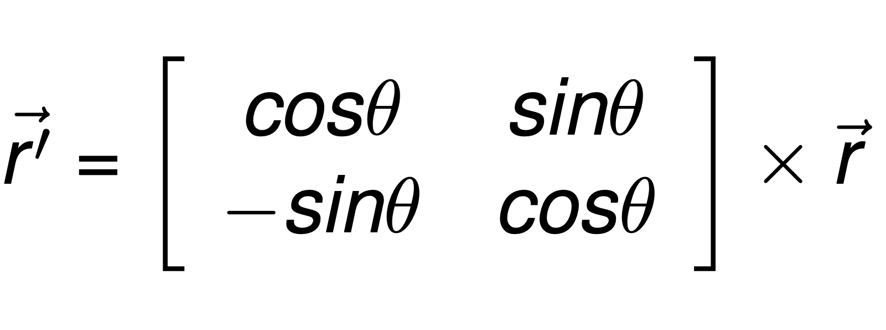

## Vetores e Matrizes
### Revisão e exercícios

---
### Matriz de Rotação

<iframe width="1138" height="640" src="https://www.youtube.com/embed/VtG0emfNAeU" frameborder="0" allow="accelerometer; autoplay; clipboard-write; encrypted-media; gyroscope; picture-in-picture" allowfullscreen></iframe>

---
### Matriz de Rotação

Dado um ponto $\vec{r} = [x,y]$ (um vetor coluna) no plano cartesiano e um ângulo $\theta$, o vetor



representa a rotação de $\vec{r}$ em $\theta$ graus. 

Escreva uma função que recebe como parâmetros $\theta$ e um ponto $\vec{r}$ e calcula $\vec{r'}$.

---
### Matriz de Rotação

As funções trigonométricas da biblioteca `cmath` trabalham em radianos.

```cpp
// Graus em radianos
double toRad(double A){
    return (M_PI * A) / 180.0 ;
}
```

---
### Matriz de Rotação
Calculamos o produto: 
```cpp
void rotar(double v[], double r[], double ang){
    double x,y;
    ang = toRad(ang);
    x = cos(ang) * v[0] + sin(ang)*v[1];
    y = -1 * sin(ang) * v[0] + cos(ang)*v[1];
    r[0] = x;
    r[1] = y;
}
```
- _Entrada_: o vetor `v[]` e o ângulo `ang`
- _Saída_: o resultado será armazenado no parâmetro `r`

```
---
### Multiplicação de matrizes

Faça uma função para multiplicar duas matrizes. 

Lembre: $M \times N$ faz sentido sim:
 - $M$ é de dimensão $a \times b$
 - $N$ é de dimensão $b \times c$
 - O resultado $M\times N$ é de dimensão $a \times c$

---
### Multiplicação de matrizes
O resultado $R = M \times N$:
- A posição $R[i][j]$ corresponde ao produto escalar da linha $i$ de $M$ e a coluna $j$ de $N$.

```
               - x - -
- - - - -      - x - -
x x x x x   *  - x - -
- - - - -      - x - -
               - x - -
```

---
### Multiplicação de matrizes

- Entradas: As matrizes M e N
- As dimensões: a,b,c
- Saídas: A matriz $M \times N$

---
### Multiplicação de matrizes
```cpp
void mult(int M1[][TAM], int M2[][TAM], 
          int nlm1, int ncm1, int ncm2, int M3[][TAM]){
    for(int i=0 ; i < nlm1 ; i++){
        for(int j=0 ; j < ncm2 ; j++){
            // Produto escalar: 
            // linha i de M1 coluna j de M2
            int soma = 0;
            for (int k = 0 ; k < ncm1 ; k++){
                soma += M1[i][k] * M2[k][j];
            }
            M3[i][j] = soma;
        }
    }

}
```
---
### Multiplicação de matrizes
Note que o último parâmetro da função será utilizado como saída: 

```cpp
int main(){
    int A[TAM][TAM], B[TAM][TAM], C[TAM][TAM];
    int la,ca,cb;
    cout << "Linhas e colunas de A e colunas de B" << endl ;;
    cin >> la >> ca >> cb ;
    cout << "Matriz A" << endl;
    ler(A,la,ca);
    cout << "Matriz B" << endl;
    ler(B,ca,cb);
    mult(A,B,la,ca,cb,C);
    cout << "Matriz A" << endl;
    imprimir(A, la, ca);
    cout << "Matriz B" << endl;
    imprimir(B, ca, cb);
    cout << "Matriz C" << endl;
    imprimir(C, la, cb);

    return 0;
}
```

---
### Matrizes de char 

Podemos ver uma matriz como um vetor de vetores

Portanto, a matriz
```cpp
char M[TAM][TAM];
```

pode ser vista como um vetor de strings

__Cada linha é uma string!__

---
### Matrizes de char

Por exemplo:

```cpp
linha0: 'a' , 'l', 'o' , 0 ....
linha1: 'm' , 'u', 'n', 'd', 'o', 0, ....
linda2: 'h' , 'i', '!', 0, ...
```
---
### Matrizes de char

A função `strcmp` da biblioteca `cstring`
```cpp
int strcmp(char str1[], char str2[]);
```

retorna: 
 - 0 se `s1` é igual a `s2`.
 - $<0$ se `s1 < s2`
 - $>0$ se `s1 > s2`

 Ordem lexicográfica: 

 ```cpp
cout << strcmp("ola", "ola") << endl; //0
//'o' = 111, 'h' = 104
cout << strcmp("ola", "hola") << endl; //7
//'l'=108, 'n'= 110
cout << strcmp("ola","onda") << endl; //-2
```
---
### Matrizes de char

Como podemos buscar uma palavra em uma lista de palavras?

1. Percorremos cada linha da matriz
2. Utilizamos a função `strcmp`

```cpp
// M[i] é uma string!
bool estaPalavra(char M[][TAM], int n, char s[]){
    for(i=0;i < n ; i++){
        if(strcmp(M[i], s)==0)
            return true;
    }
    return false;
}
```
---
### Matrizes de char

Por exemplo:
```cpp
 char portugues[][MAX_LENGTH] =
    { "tirar","pronto","pegar","cha","cartera","acordar",
    "combinar","bolso","cedo","exquisito"};

 if (estaPalavra(portugues, 10, "cedo" ))
     cout << " a palavra está no dicionário! " << endl;
```

---
### Matrizes de char

Podemos utilizar essa ideia para implementar um tradutor muito simples: 

```cpp
 char portugues[][MAX_LENGTH] =
    { "tirar","pronto","pegar","cha","cartera","acordar",
    "combinar","bolso","cedo","exquisito"};

 char espanol[][MAX_LENGTH] = 
    {"sacar","listo","tomar","te","billetera","despertar",
    "acordar","cartera","pronto","raro"};

```
---
### Matrizes de char

Modificamos a função `estaPalavra` para que também retorne o índice:
```cpp
bool estaPalavra(char M[][TAM], int n, char s[], int &idx){
    for(i=0;i < n ; i++){
        if(strcmp(M[i], s)==0){
            idx = i;
            return true;
        }
    }
    idx = -1; // Palavra não encontrada
    return false;
}
```


---
### Matrizes de char

Agora implementamos uma função que "retorne" a palavra:
```cpp
bool traduzir(char DIC1[][TAM], char DIC2[][TAM], 
      int n, char pal1[], char pal2[]);
```

A função retorna `true` se a operação foi bem sucedida. 


---
### Matrizes de char

Como podemos copiar o conteúdo de uma string?

A função `strcpy` da biblioteca `cstring`:
```cpp
char s1[TAM] = "alo";
char s2[TAM];
// Copiar em s2 o contúdo de s1
strcpy(s2, s1); // s2 armazena "alo"
```

---
### Matrizes de char
```cpp
bool traduzir(char DIC1[][TAM], char DIC2[][TAM], 
   int n, char pal1[], char pal2[]){
 int pos;
 bool esta =estaPalavra(DIC1, n, pal1, pos);
 if (esta){
     strcpy(pal2, DIC2[pos]);
     return true;
 }
 else return false;
}
```
---
### Teste
<https://multiprova.ufrn.br/>

